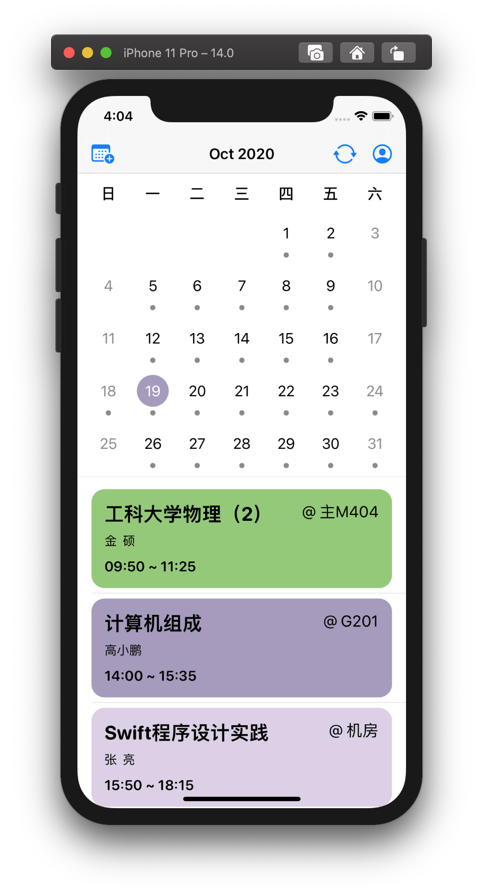
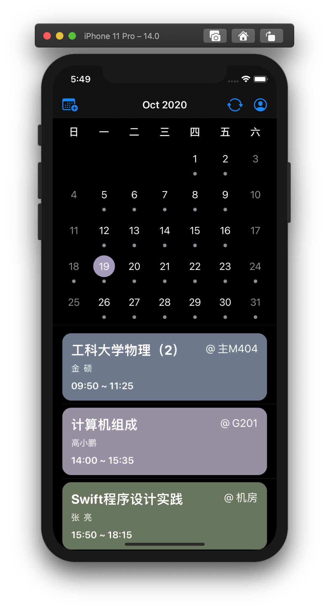
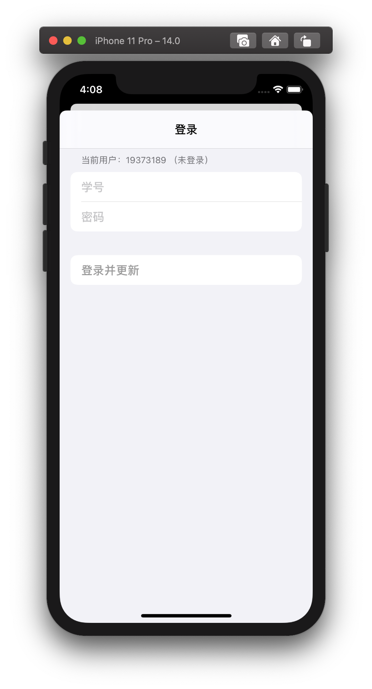
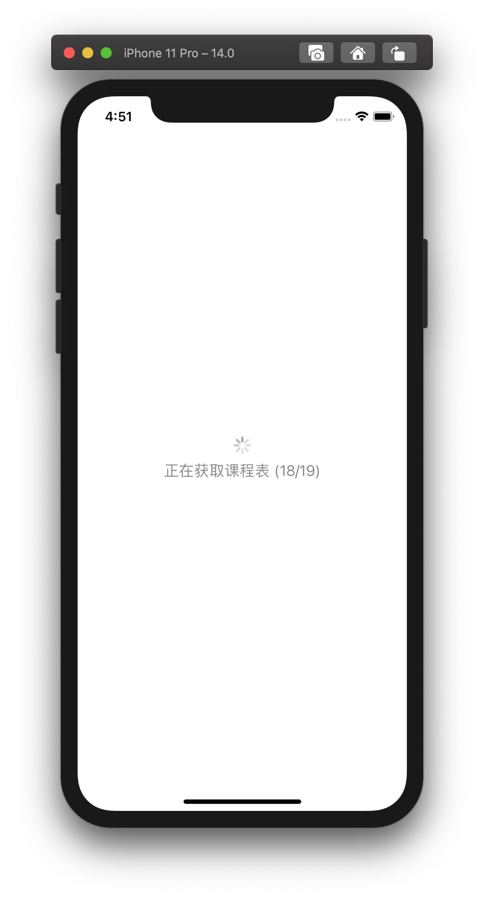
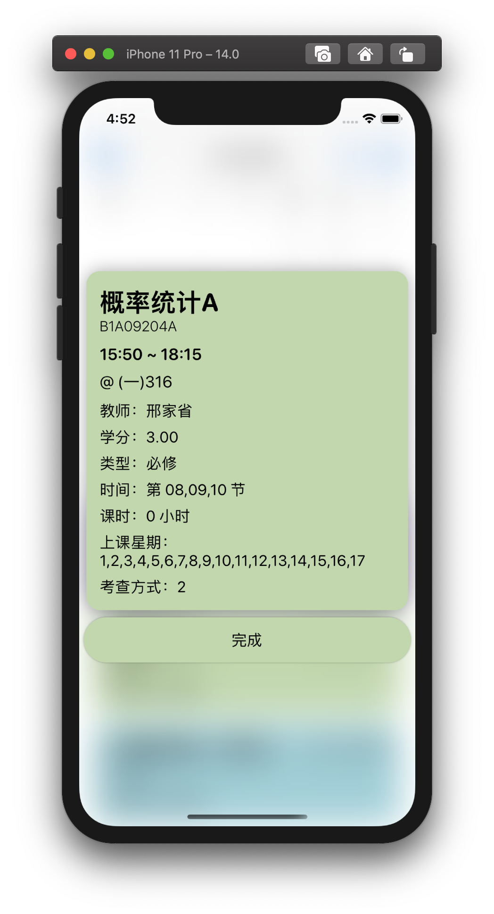
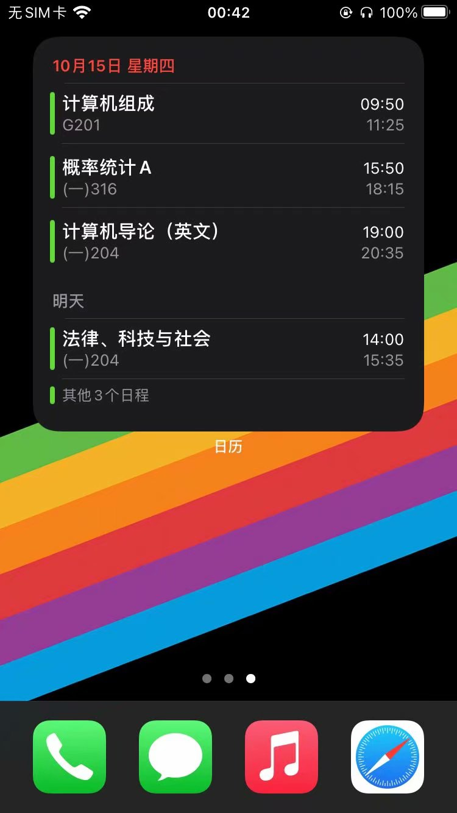

# 设计目的

很多同学都依赖信息北航来查询课程，但是信息北航的课程表没有提醒上课的功能。也有些同学使用一些 App，但是这些 App 冗余信息过多，往往存在广告。

经过调研，我发现可以利用系统自带的“日历” App 来满足同学们对于课程查看和提醒的需求。为此，我开发了这个 App，用于查看课程信息，并可以将其导入系统原生的“日历” App。

本 App 使用了 SwiftUI 2.0 编写。

# 界面设计

App 主要可以分为三个界面，分别是主界面，“登陆”界面和“课程详细信息”界面。

## 主界面

主界面由日历头部，日历和课程列表三部分构成。

其中，header 包括了当前月份显示以及三个按钮，三个按钮分别用于“添加课程事项到系统日历”，“更新课程列表”和“用户登录”。

日历界面可以单击对应的日期来切换课程列表的显示；左右划动日历界面可以切换月份。当选中其他日期时，当天日期会用一个阴影来突出强调。

课程列表可以显示选中日期的课程列表。其中不同的课程会用不同的颜色来表示。点击相应的课程可以进入“课程详细信息”界面。

## 登陆界面

登录界面是一个 sheet，包括四部分。

其中，最上面是提示文字，会根据不同的登录情况显示不同的信息。
- 如果用户是第一次使用，则会显示“登录信息北航”。
- 如果用户以前登录过，但是现在没有处于登录状态，则会显示“当前用户” + 学号 + “（未登录）”
- 如果用户以前登录过，但是现在处于登录状态，则会显示“当前用户” + 学号 + “（已登录）”

接下来分别是用户输入学号（`numberPad`）和密码的输入框（`SecureField`）。

最后是一个“登录”按钮。只有当用户输入了学号和密码时，“登录”按钮才可用。

点击“登录”按钮后的界面逻辑有三种：
- 当用户已经登录了账号时，点击登录按钮会显示一个 alert “检测到您已经登录账号，是否切换用户？”。
- 确认登录后，如果登录不成功，则显示一个 alert “请检查学号和密码是否输入正确”。
- 如果登录成功则进入一个加载界面（ProgressView），同时更新课程。

## 课程详细信息界面

课程详细信息界面在单击课程项目时显示。

显示课程详细信息时，背景会进行高斯模糊，同时课程卡片会使用阴影来突出显示内容。

## 配合系统“日历”使用

# 代码结构与介绍

项目采用 MVVM 架构。

- `/ViewModels`： 存储 ViewModels
    + `LoginViewModel.swift`： 用于登录的逻辑
    + `AddEventToCalendarViewModel.swift`： 用于将课程添加到系统日历
    + `UpdatingViewModel.swift`： 用于更新课程操作
- `/Views`： 存储 SwiftUI 描述的界面
    + `PagerView.swift`：
    + `CalendarList.swift`： 日历界面和课程列表界面
    + `LoginSheet.swift`： 登陆界面
    + `/Components`： 包括 UI 中用到的各种组件
      + `/EventCard`： 课程卡片的 UI
        + `EventCard.swift`： 课程卡片 UI
        + `EventCardDetailModal.swift`： 课程详细信息的 UI
      + `/Calendar`： 日历 UI
        + `CalendarMonthView.swift`： 月份
        + `CalendarMonthHeader.swift`： 日历头部（星期）
        + `CalendarViewDay.swift`： 单天的按钮
- `/Utilities`： 逻辑组件
    + `DataStorage.swift`： 存储用户信息
    + `CalendarUtils.swift`： 日期时间运算
    + `ExtensionColor.swift`： 颜色处理
- `Models`： 定义数据 Models
    + `CalendarEventModel.swift`： 定义某一天的时间 Model
    + `CalendarEventDataModel.swift`： 某个课程的信息 Model
    + `CalendarMonthModel.swift`： 某一个月份的数据 Model
- `ContentView.swift`： 课程内容
- `BUAACalApp.swift`： App 主体

### `LoginViewModel.swift`

本文件包含了一个类 `LoginViewModel`，用于存储登录的相关信息。与 `LoginSheet.swift` 相对应。

- `LoginViewModel`
  + `@Published` 变量
    + `currentUserId`： 当前用户的 Id，打开 App 时会自动调用 `DataStorage.loadUserId()` 从 `UserDefaults` 中读取用户学号信息
    + `userId`：存储用户输入的学号
    + `password`：存储用户输入的密码
    + `isLogin`：保存用户是否登录
  + 函数
    + `login(:LoginSheet)`：传入绑定的 `LoginSheet`，进行登录

### `AddEventToCalendarViewModel.swift`

本文件包含了一个类 `AddEventToCalendarViewModel`，用于添加事件到系统日历。

- `AddEventToCalendarViewModel`
  + `@Published` 变量
    + `isFinished`: 返回是否添加成功
  + 函数
    + `addEventToCalendar()[Date: [CalendarEvent<CalendarEventDataModel>]]`：添加事件到日历

### `UpdatingViewModel.swift`

本文件包含了一个类 `UpdatingViewModel`，用于更新课程列表。

- `UpdatingViewModel`
  + `@Published` 变量
    + `isUpdating`：是否正在更新
    + `events`：存储所有的课程信息
    + `cntFinished`：存储当前有几个异步任务已经完成（用于判断是否所有任务都已经完成）
  + 函数
    + `updateEvents`：更新课程

## Utilities

## Models

### `CalendarEvent.swift`

本文件用于存储某一课程的数据，用于 UI 显示。

- `CalendarEvent`
  - `date: Date`：课程所在日期
  - `data: T`：课程详细数据
  - `calendar: Calendar`：日历

### `CalendarEventDataModel.swift`

本文件用于存储某一课程的详细数据。

- `CalendarEventDataModel`
  - `courseID: String`：课程编号
  - `eventName: String`：课程名称
  - `startTime: Date`：课程开始时间
  - `endTime: Date`：课程结束时间
  - `weeks: String`：上课的星期
  - `courseType: String`：课程类型
  - `credit: Double`：课程学分
  - `examType: Int`：课程考核方式
  - `lessons: String`：上课的节数
  - `indicatorName: String`：教师名称
  - `locationName: String`：上课地点
  - `courseHour: String`：上课时长
  - `brightColorNumber: Int`：日间模式颜色
  - `darkColorNumber: Int`：夜间模式颜色

## Utilities

### `DataStorage.swift`

本文件用于进行存储操作。

- `DataStorage`
  - `saveData([Date: [CalendarEvent<CalendarEventDataModel>]])`：存储课程数据
  - `saveData() -> [Date: [CalendarEvent<CalendarEventDataModel>]]`：读取课程数据
  - `saveUserId(String)`：存储用户学号
  - `loadUserId() -> String`：读取用户学号
